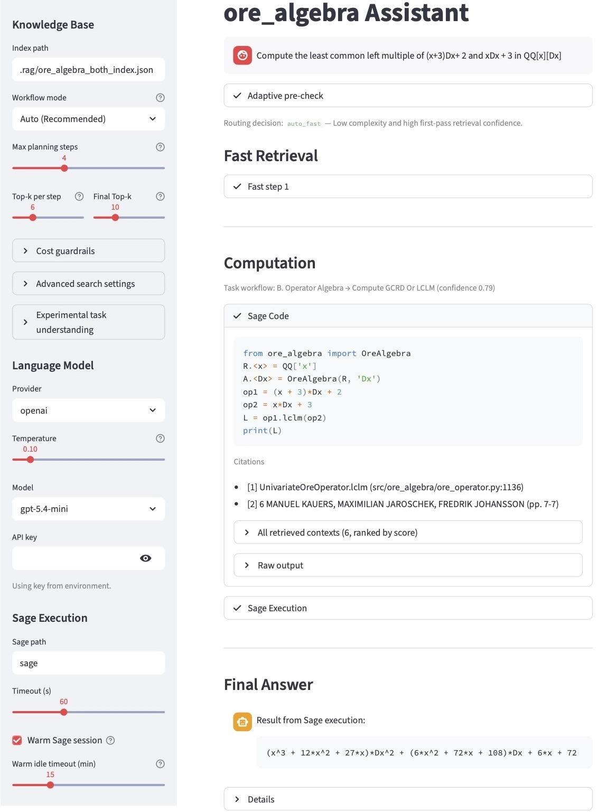

# ore_algebra Agentic RAG Assistant

This repo provides a local Streamlit chat app for exploring `ore_algebra`
documentation and generating retrieval-grounded answers/code.

## Screenshot



The public repo is intentionally lightweight:

- no committed generated documentation artifacts,
- no committed PDFs,
- no committed prebuilt indexes,
- no private research, benchmark, or workbench material.

You build the knowledge base locally from your own
[`ore_algebra`](https://github.com/mkauers/ore_algebra) clone, with optional
local guide PDFs.

## Included Apps

- `streamlit_chat_app.py`: main chat UI
- `streamlit_app.py`: retrieval-only UI
- `ore_rag_assistant.py`: index-building CLI

The real implementations live under `ui/` and `core/`. The root files are
convenient entrypoints.

## Requirements

- Python 3.11+
- SageMath 10.0 with
  [`ore_algebra`](https://github.com/mkauers/ore_algebra) available in the Sage
  environment
- a local [`ore_algebra`](https://github.com/mkauers/ore_algebra) clone

This project is currently set up and tested against SageMath 10.0.

## Setup

1. Clone this repo.

```bash
git clone https://github.com/LixinDu/ore-algebra-agentic-rag-assistant.git
cd ore-algebra-agentic-rag-assistant
```

2. Clone [`ore_algebra`](https://github.com/mkauers/ore_algebra) next to it,
   for example:

```bash
cd ..
git clone https://github.com/mkauers/ore_algebra ore_algebra-master
```

3. Create a virtual environment and install dependencies:

```bash
cd ore-algebra-agentic-rag-assistant
python3 -m venv .venv
source .venv/bin/activate
python3 -m pip install -r requirements.txt
```

4. Place the two local guide PDFs from [KJJ15](#kjj15) and [KM19](#km19) at:

```text
data/ore_algebra_guide.pdf
data/ore_algebra_guide_multivariate.pdf
```

5. Build the combined index:

Run:

```bash
python3 scripts/refresh_knowledge_base.py --index-mode both
```

Before running the command, make sure the default profile in
[config/knowledge_base.json](config/knowledge_base.json) matches your local
paths:

```text
ore_algebra clone: ../ore_algebra-master
main guide PDF: data/ore_algebra_guide.pdf
multivariate guide PDF: data/ore_algebra_guide_multivariate.pdf
```

If your local paths are different, edit that file before building the index.

This builds the combined `both` index at:

```text
.rag/ore_algebra_both_index.json
```

## Run The App

Main chat UI:

```bash
streamlit run streamlit_chat_app.py
```

The public chat UI defaults to the combined `both` index. If you build a
different index, change the `Index path` field in the sidebar.

Retrieval-only UI:

```bash
streamlit run streamlit_app.py
```

## Notes

- This public version keeps the retrieval results UI, but the knowledge base is
  expected to be built locally by the user.
- The recommended local setup uses both generated `ore_algebra` docs and local
  guide PDFs.
- The public sidebar uses the classic retrieval strategy only.
- Experimental graph-retrieval code is still present in the codebase, but it is
  not exposed in this public UI.
- OpenAI, Gemini, and Ollama options are available in the chat app. API keys
  are read from the environment or entered in the sidebar.

## Key Files

- [config/knowledge_base.json](config/knowledge_base.json): local path/profile
  settings for generated docs, PDFs, and indexes
- [scripts/refresh_knowledge_base.py](scripts/refresh_knowledge_base.py):
  refresh local artifacts from the configured upstream
  [`ore_algebra`](https://github.com/mkauers/ore_algebra) clone

## References

- <a id="kjj15"></a>[KJJ15] M. Kauers, M. Jaroschek, and F. Johansson. *Ore polynomials in
  Sage*. In *Computer Algebra and Polynomials*, pages 105-125. Springer, 2015.
- <a id="km19"></a>[KM19] M. Kauers and M. Mezzarobba. *Multivariate Ore polynomials in
  SageMath*. *ACM Communications in Computer Algebra*, 53(2):57-60, 2019.
